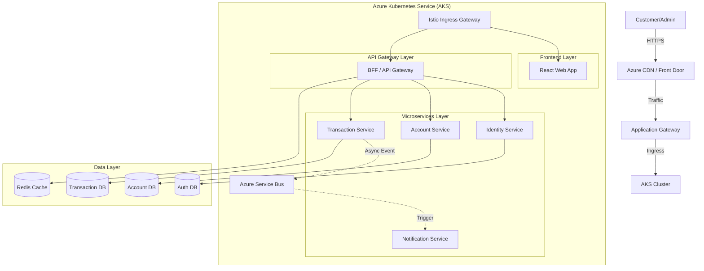

# 🏦 Cloud-Native Banking Platform on Azure

[](https://github.com/ashishserco/banking-platform/actions)
[](LICENSE)
[](https://azure.microsoft.com)
[](https://dotnet.microsoft.com)
[](https://reactjs.org)
[](https://kubernetes.io)
[](https://www.terraform.io)

## 📖 Overview

This repository hosts a **complete, enterprise-grade banking platform** engineered with Cloud-Native principles. It is designed to demonstrate how to build scalable, resilient, and secure financial systems on **Microsoft Azure** using efficient microservices architecture.

The solution covers the full software lifecycle: from **Infrastructure as Code (IaC)** provisioning to **CI/CD automation**, **Service Mesh** implementation, and **Observability**.

---

## 🏗️ Architecture

The system is built as a set of loosely coupled microservices deployed on Azure Kubernetes Service (AKS), communicating via a Service Mesh (Istio) and asynchronous messaging (Azure Service Bus).



---

## 🚀 Key Features

### ✨ Core Banking Capabilities
*   **Account Management**: Create savings/checking accounts with KYC integration.
*   **Secure Transactions**: ACID-compliant fund transfers with idempotency checks.
*   **Payment Gateway**: Integration with mock payment providers.
*   **Real-time Notifications**: Email/SMS alerts driven by event bus.

### 🛡️ Enterprise Grade
*   **Security First**: OAuth2/OIDC (IdentityServer4), mTLS (Istio), Secrets Management (Key Vault).
*   **Resilience**: Circuit Breakers (Polly), Retries, Bulkhead patterns.
*   **Observability**: Distributed Tracing (Jaeger/Zipkin), Logs (ELK), Metrics (Prometheus/Grafana).
*   **Scalability**: HPA (Horizontal Pod Autoscaler) and Cluster Autoscaler.

---

## 🛠️ Technology Stack

| Area | Technology |
| :--- | :--- |
| **Backend** | .NET Core 8, C#, EF Core, SignalR |
| **Frontend** | React 18, TypeScript, TailwindCSS, Vite |
| **Database** | Azure SQL Database (Polýglot persistence compliant), CosmosDB |
| **Messaging** | Azure Service Bus (Pub/Sub) |
| **Infrastruture (IaC)** | Terraform, Azure ARM Templates |
| **Containerization** | Docker, Helm Charts |
| **Orchestration** | Azure Kubernetes Service (AKS), Istio (Service Mesh) |
| **CI/CD** | GitHub Actions, Azure DevOps |
| **Monitoring** | ELK Stack (Elasticsearch, Logstash, Kibana), Prometheus, Grafana |

---

## 📂 Repository Structure

```bash
cloud-native-banking-platform-azure/
├── .github/                 # GitHub Actions Workflows
├── backend/                 # .NET Microservices
│   ├── src/                 
│   │   ├── Identity/        # Auth & User Management
│   │   ├── Accounts/        # Account Logic
│   │   └── Transactions/    # Money Transfer Logic
├── frontend/                # React Application
├── terraform/               # Infrastructure as Code
├── helm/                    # Kubernetes Charts & Manifests
├── istio/                   # Service Mesh Config
└── docs/                    # Architecture Decisions (ADR)
```

---

## ⚡ Getting Started

### Prerequisites
*   [Docker Desktop](https://www.docker.com/products/docker-desktop)
*   [.NET 8.0 SDK](https://dotnet.microsoft.com/download)
*   [Node.js 18+](https://nodejs.org/)
*   [Azure CLI](https://docs.microsoft.com/en-us/cli/azure/install-azure-cli)
*   [Terraform](https://www.terraform.io/downloads)

### 1. Clone the Repository
```bash
git clone https://github.com/ashishserco/banking-platform.git
cd banking-platform
```

### 2. Infrastructure Provisioning (Optional)
If you want to deploy to real Azure resources:
```bash
cd terraform
terraform init
terraform apply -auto-approve
```

### 3. Run Locally (Docker Compose)
We provide a compose file to spin up the entire stack locally, including databases.
```bash
docker-compose up -d --build
```
*   **Frontend**: http://localhost:3000
*   **API Gateway**: http://localhost:5000
*   **Identity Server**: http://localhost:5001

---

## 🧪 Testing

### Backend Tests
Each microservice has Unit and Integration tests using xUnit.
```bash
dotnet test
```

### Frontend Tests
Using Jest and React Testing Library.
```bash
cd frontend
npm test
```

---

## 🤝 Contributing

Contributions are welcome! Please read our [Contribution Guidelines](CONTRIBUTING.md) before submitting a Pull Request.

1.  Fork the Project
2.  Create your Feature Branch (`git checkout -b feature/AmazingFeature`)
3.  Commit your Changes (`git commit -m 'Add some AmazingFeature'`)
4.  Push to the Branch (`git push origin feature/AmazingFeature`)
5.  Open a Pull Request

---

## 📄 License

Distributed under the MIT License. See `LICENSE` for more information.

---

> **Note**: This project is intended for educational and demonstration purposes. Ensure proper security reviews before deploying to a critical production environment.
