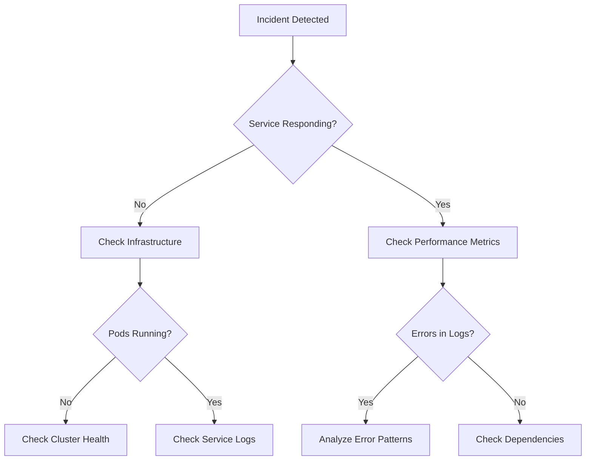

# Incident Response Runbook

## Overview

This runbook provides comprehensive procedures for responding to incidents in the banking platform. It covers incident classification, response procedures, communication protocols, and post-incident activities.

## 🚨 Incident Classification

### Severity Levels

#### Severity 1 (Critical) - Business Impacting
**Definition**: Complete system outage or security breach affecting customer transactions
**Examples**:
- All services down (>5 minutes)
- Database corruption or data loss
- Security breach or unauthorized access
- Payment processing completely failed
- Data center outage

**Response Time**: Immediate (< 5 minutes)
**Notification**: Executives, all teams, customers (if needed)

#### Severity 2 (High) - Service Degraded
**Definition**: Significant performance degradation or partial service outage
**Examples**:
- Single critical service down (Account/Transaction service)
- Severe performance degradation (>10x normal response time)
- Intermittent transaction failures (>10%)
- Authentication issues affecting multiple users

**Response Time**: < 15 minutes
**Notification**: Management team, engineering teams

#### Severity 3 (Medium) - Minor Impact
**Definition**: Non-critical service issues or minor performance problems
**Examples**:
- Single non-critical service down (Notification service)
- Minor performance degradation (<3x normal)
- Isolated user issues
- Non-critical feature unavailable

**Response Time**: < 30 minutes
**Notification**: Engineering teams, on-call personnel

#### Severity 4 (Low) - Minimal Impact
**Definition**: Issues with minimal business impact
**Examples**:
- Monitoring alerts without service impact
- Documentation issues
- Non-production environment problems

**Response Time**: Next business day
**Notification**: Responsible team only

## 📞 Incident Response Team

### Core Response Team

#### Incident Commander (IC)
**Role**: Overall incident coordination and decision making
**Responsibilities**:
- Coordinate response efforts
- Make critical decisions
- Communicate with stakeholders
- Ensure proper documentation

**Primary**: Operations Manager
**Backup**: Platform Engineering Lead

#### Technical Lead
**Role**: Technical investigation and resolution
**Responsibilities**:
- Lead technical troubleshooting
- Coordinate with engineering teams
- Implement fixes and workarounds
- Verify resolution

**Primary**: Senior Platform Engineer
**Backup**: Principal Software Engineer

#### Communications Lead
**Role**: Internal and external communications
**Responsibilities**:
- Stakeholder notifications
- Status page updates
- Customer communications
- Media/regulatory reporting

**Primary**: Product Manager
**Backup**: Engineering Manager

### Extended Response Team

#### Database Administrator
**Availability**: On-call 24/7
**Responsibilities**: Database-related incidents, backup/restore

#### Security Specialist
**Availability**: On-call for Sev 1/2 security incidents
**Responsibilities**: Security incident response, compliance

#### Network Engineer
**Availability**: On-call during business hours
**Responsibilities**: Network and infrastructure issues

## 🚀 Incident Response Process

### Phase 1: Detection and Initial Response (0-5 minutes)

#### Immediate Actions
1. **Acknowledge Alert**
   ```bash
   # Acknowledge in monitoring system
   # Stop alert escalation
   ```

2. **Initial Assessment**
   ```bash
   # Quick health check
   kubectl get pods -n banking-platform-prod
   curl -I https://api.banking-platform.com/health
   ```

3. **Incident Declaration**
   ```bash
   # If confirmed incident, declare immediately
   # Create incident in incident management system
   ```

4. **Assemble Response Team**
   - Page Incident Commander
   - Page Technical Lead
   - Activate incident bridge/channel

#### Decision Matrix
```
Service Down + Customer Impact = Severity 1
Service Down + No Customer Impact = Severity 2  
Performance Degradation + Customer Complaints = Severity 2
Performance Degradation + No Complaints = Severity 3
```

### Phase 2: Investigation and Diagnosis (5-15 minutes)

#### Technical Investigation Checklist
1. **Service Status Check**
   ```bash
   # Check all service health
   for service in account transaction payment notification; do
     echo "Checking $service..."
     kubectl get pods -n banking-platform-prod -l app.kubernetes.io/name=$service
     kubectl logs --tail=50 -l app.kubernetes.io/name=$service -n banking-platform-prod
   done
   ```

2. **Infrastructure Health**
   ```bash
   # Check cluster health
   kubectl get nodes
   kubectl top nodes
   kubectl get events --sort-by='.lastTimestamp' | tail -20
   ```

3. **External Dependencies**
   ```bash
   # Check Azure services
   az monitor activity-log list --resource-group banking-platform-prod-rg --max-events 10
   
   # Check database status
   az sql db show --name BankingAccountsDb --server banking-platform-prod-sql
   ```

4. **Recent Changes Review**
   ```bash
   # Check recent deployments
   helm history banking-platform-prod -n banking-platform-prod
   
   # Check recent commits
   git log --oneline --since="2 hours ago"
   ```

#### Investigation Framework


### Phase 3: Mitigation and Resolution (15+ minutes)

#### Immediate Mitigation Strategies

1. **Service Recovery**
   ```bash
   # Restart failing service
   kubectl rollout restart deployment/<service-name> -n banking-platform-prod
   
   # Scale up if resource issue
   kubectl scale deployment <service-name> --replicas=5 -n banking-platform-prod
   ```

2. **Traffic Redirection**
   ```bash
   # Redirect traffic using Istio
   kubectl apply -f - <<EOF
   apiVersion: networking.istio.io/v1beta1
   kind: VirtualService
   metadata:
     name: <service>-maintenance
   spec:
     hosts:
     - <service>
     http:
     - match:
       - headers:
           maintenance:
             exact: "true"
       fault:
         abort:
           percentage:
             value: 100
           httpStatus: 503
   EOF
   ```

3. **Rollback Procedures**
   ```bash
   # Emergency rollback
   helm rollback banking-platform-prod <previous-version> -n banking-platform-prod --wait
   
   # Verify rollback success
   kubectl get pods -n banking-platform-prod
   curl https://api.banking-platform.com/health
   ```

4. **Database Recovery**
   ```bash
   # Point-in-time restore (if needed)
   az sql db restore --dest-name banking-restore-$(date +%s) \
     --server banking-platform-prod-sql \
     --source-database BankingAccountsDb \
     --time "2023-XX-XXTXX:XX:XX"
   ```

#### Resolution Verification Checklist
- [ ] All services responding to health checks
- [ ] Error rates returned to normal levels
- [ ] Performance metrics within acceptable range
- [ ] End-to-end transaction flow working
- [ ] No data corruption detected
- [ ] Monitoring alerts cleared

### Phase 4: Communication (Ongoing)

#### Internal Communications

**Incident Bridge Setup**
```bash
# Create incident Slack channel
# Invite all response team members
# Set up conference bridge for voice communication
```

**Status Update Template**
```
🚨 INCIDENT UPDATE - [INCIDENT-ID]
Severity: [1/2/3/4]
Status: [INVESTIGATING/MITIGATING/RESOLVED]
Impact: [Description of customer impact]
ETA: [Expected resolution time]
Next Update: [Time of next update]
IC: [Incident Commander name]
```

**Update Frequency**
- Severity 1: Every 15 minutes
- Severity 2: Every 30 minutes  
- Severity 3: Every hour
- Severity 4: Daily or as needed

#### External Communications

**Customer Communication**
- Status page updates for Severity 1 & 2
- Direct customer notification for account-specific issues
- Social media monitoring and response

**Regulatory Notification**
- Financial regulators (if customer data involved)
- Data protection authorities (for security incidents)
- Law enforcement (for security breaches)

**Stakeholder Notification Matrix**
| Severity | CEO | CTO | Legal | Marketing | Customers |
|----------|-----|-----|-------|-----------|-----------|
| 1        | ✅   | ✅   | ✅     | ✅         | ✅         |
| 2        | ✅   | ✅   | ❌     | ✅         | ⚠️         |
| 3        | ❌   | ✅   | ❌     | ❌         | ❌         |
| 4        | ❌   | ❌   | ❌     | ❌         | ❌         |

## 🛠️ Common Incident Scenarios

### Scenario 1: Complete Service Outage

**Symptoms**: All API endpoints returning 5xx errors
**Likely Causes**: Cluster failure, network issues, database unavailable

**Investigation Steps**:
1. Check cluster connectivity
   ```bash
   kubectl cluster-info
   kubectl get nodes
   ```

2. Check critical pods
   ```bash
   kubectl get pods --all-namespaces | grep -v Running
   ```

3. Check Azure service health
   ```bash
   az monitor activity-log list --resource-group banking-platform-prod-rg
   ```

**Resolution Actions**:
1. If cluster issue - check with Azure support
2. If application issue - rollback to last known good version
3. If database issue - check connection strings and firewall rules

### Scenario 2: Payment Processing Failures

**Symptoms**: Payment transactions failing, users unable to transfer money
**Impact**: High - core banking functionality affected

**Investigation Steps**:
1. Check payment service health
   ```bash
   kubectl logs -l app.kubernetes.io/name=payment-service -n banking-platform-prod --tail=100
   ```

2. Check external payment gateway connectivity
   ```bash
   # Test external API connectivity from pod
   kubectl exec -it <payment-pod> -n banking-platform-prod -- curl -v https://external-payment-gateway.com/health
   ```

3. Check database payment tables
   ```sql
   -- Check for stuck transactions
   SELECT COUNT(*) FROM Payments WHERE Status = 'PENDING' AND CreatedAt < DATEADD(hour, -1, GETUTCDATE());
   ```

**Resolution Actions**:
1. Restart payment service if application issue
2. Check external service status pages
3. Implement payment queue processing if backlog exists
4. Consider manual payment processing for critical transactions

### Scenario 3: Database Performance Degradation

**Symptoms**: Slow API responses, database timeouts in logs
**Impact**: Medium to High depending on severity

**Investigation Steps**:
1. Check database DTU usage
   ```bash
   az sql db show-usage --name BankingAccountsDb --server banking-platform-prod-sql
   ```

2. Identify slow queries
   ```sql
   -- Query store analysis for slow queries
   SELECT TOP 10 * FROM sys.query_store_query_text 
   ORDER BY last_execution_time DESC;
   ```

3. Check for blocking transactions
   ```sql
   -- Find blocking sessions
   SELECT * FROM sys.dm_exec_requests WHERE blocking_session_id <> 0;
   ```

**Resolution Actions**:
1. Kill long-running blocking transactions
2. Scale up database DTUs if needed
3. Restart application pools to reset connections
4. Optimize problematic queries

### Scenario 4: Security Incident

**Symptoms**: Unusual authentication patterns, suspicious database queries, security alerts
**Impact**: Critical - potential data breach

**Immediate Actions**:
1. **Preserve Evidence**
   ```bash
   # Capture logs immediately
   kubectl logs <suspicious-pod> -n banking-platform-prod > incident-logs.txt
   
   # Capture network traffic if possible
   # Document all suspicious activities
   ```

2. **Containment**
   ```bash
   # Isolate affected pods/services
   kubectl label pod <suspicious-pod> quarantine=true -n banking-platform-prod
   
   # Update network policies to isolate
   kubectl apply -f quarantine-network-policy.yaml
   ```

3. **Assessment**
   - Determine scope of potential data access
   - Check for data exfiltration
   - Verify integrity of financial data
   - Review audit logs for unauthorized changes

**Resolution Process**:
1. Coordinate with security team and legal
2. Follow data breach notification procedures
3. Implement additional security measures
4. Conduct thorough security audit
5. Update security policies and procedures

## 📊 Post-Incident Activities

### Immediate Post-Resolution (0-2 hours)

1. **Verification and Monitoring**
   ```bash
   # Extended monitoring period
   # Verify all metrics returned to normal
   # Check for any lingering issues
   ```

2. **Stakeholder Notification**
   - Update status page with resolution
   - Notify all stakeholders of resolution
   - Thank response team members

3. **Initial Documentation**
   - Document timeline of events
   - Record resolution steps taken
   - Note any temporary workarounds

### Post-Incident Review (24-48 hours)

#### Mandatory Review Items
- [ ] Root cause analysis completed
- [ ] Timeline accuracy verified
- [ ] Impact assessment documented
- [ ] Response effectiveness evaluated
- [ ] Communication effectiveness reviewed

#### Review Template
```markdown
# Post-Incident Review: [INCIDENT-ID]

## Incident Summary
- **Date/Time**: 
- **Duration**: 
- **Severity**: 
- **Services Affected**: 
- **Customer Impact**: 

## Timeline
| Time | Event | Action Taken | By Whom |
|------|-------|--------------|---------|
|      |       |              |         |

## Root Cause Analysis
### What Happened?
### Why Did It Happen?
### Contributing Factors

## Response Evaluation
### What Went Well?
### What Could Be Improved?
### Response Time Analysis

## Action Items
| Action | Owner | Due Date | Priority |
|--------|-------|----------|----------|
|        |       |          |          |

## Lessons Learned
### Technical Lessons
### Process Lessons
### Communication Lessons
```

### Follow-up Actions (1-4 weeks)

1. **Implement Preventive Measures**
   - Code fixes for root cause
   - Infrastructure improvements
   - Process improvements
   - Additional monitoring/alerting

2. **Update Documentation**
   - Runbook updates based on lessons learned
   - Architecture documentation updates
   - Training material updates

3. **Team Training**
   - Share lessons learned with broader team
   - Update incident response training
   - Practice scenarios based on incident

## 📋 Incident Response Tools

### Required Tools Access
- **Incident Management**: ServiceNow/Jira/PagerDuty
- **Communication**: Slack/Microsoft Teams
- **Monitoring**: Grafana/Azure Monitor
- **Logging**: Kibana/Azure Log Analytics
- **Infrastructure**: kubectl/Azure CLI/Terraform

### Emergency Access Procedures
```bash
# Break-glass access procedures for critical incidents
# Document emergency access credentials location
# Approval process for emergency access usage
# Audit trail requirements for emergency access
```

### Incident Response Automation
```bash
# Automated incident creation from critical alerts
# Automated stakeholder notification
# Automated evidence collection
# Automated initial response actions
```

## 🎯 Success Metrics

### Response Time Targets
| Severity | Detection | Response | Resolution |
|----------|-----------|----------|------------|
| 1        | <5 min    | <5 min   | <2 hours   |
| 2        | <15 min   | <15 min  | <8 hours   |
| 3        | <30 min   | <30 min  | <24 hours  |
| 4        | <1 hour   | <4 hours | <1 week    |

### Quality Metrics
- Mean Time to Detection (MTTD)
- Mean Time to Resolution (MTTR)
- Customer satisfaction with incident handling
- Repeat incident rate
- Post-incident action item completion rate

### Continuous Improvement
- Monthly incident review meetings
- Quarterly process improvement reviews
- Annual incident response training updates
- Regular simulation exercises

This runbook should be tested through regular incident simulation exercises and updated based on real incident experiences.