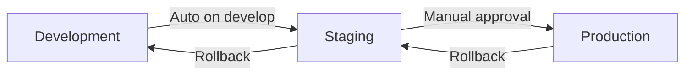

# Banking Platform CI/CD Pipelines

This directory contains comprehensive CI/CD pipeline configurations for the banking platform, supporting multiple platforms and deployment strategies.

## 🚀 Pipeline Overview

### Supported Platforms
- **Azure DevOps** - Enterprise-grade Azure-native CI/CD
- **GitHub Actions** - Cloud-native CI/CD with GitHub integration
- **Jenkins** - On-premises and hybrid deployment support

### Pipeline Features
- ✅ **Multi-stage builds** with quality gates
- ✅ **Security scanning** at every stage
- ✅ **Automated testing** (unit, integration, security)
- ✅ **Container image building** with vulnerability scanning
- ✅ **Environment-specific deployments** (dev, staging, prod)
- ✅ **Blue-green deployments** for production
- ✅ **Rollback capabilities** with automated health checks
- ✅ **Compliance reporting** and audit trails

## 📁 Structure

```
pipelines/
├── azure-pipelines.yml          # Azure DevOps pipeline
├── .github/workflows/ci-cd.yml  # GitHub Actions workflow  
├── jenkins/Jenkinsfile          # Jenkins pipeline
├── config/
│   └── environments.yml         # Environment configurations
├── scripts/
│   ├── build.sh                 # Build automation script
│   └── deploy.sh                # Deployment automation script
├── tests/
│   └── integration-tests.js     # API integration tests
└── README.md                    # This file
```

## 🔧 Setup Instructions

### Azure DevOps Setup

1. **Create Service Connections**
   ```bash
   # Azure Resource Manager connection
   az ad sp create-for-rbac --name "banking-platform-devops" --role contributor
   
   # Azure Container Registry connection
   az acr credential show --name bankingplatformacr
   ```

2. **Configure Variable Groups**
   - `banking-platform-dev` - Development environment variables
   - `banking-platform-staging` - Staging environment variables  
   - `banking-platform-prod` - Production environment variables

3. **Import Pipeline**
   ```yaml
   # In Azure DevOps, create new pipeline from existing YAML file
   # Point to: pipelines/azure-pipelines.yml
   ```

### GitHub Actions Setup

1. **Configure Repository Secrets**
   ```bash
   # Required secrets:
   ACR_USERNAME              # Azure Container Registry username
   ACR_PASSWORD              # Azure Container Registry password
   AZURE_CREDENTIALS         # Azure service principal JSON
   AZURE_RG_DEV             # Development resource group
   AZURE_RG_STAGING         # Staging resource group  
   AZURE_RG_PROD            # Production resource group
   AKS_CLUSTER_DEV          # Development AKS cluster name
   AKS_CLUSTER_STAGING      # Staging AKS cluster name
   AKS_CLUSTER_PROD         # Production AKS cluster name
   SLACK_WEBHOOK_URL        # Slack notifications webhook
   ```

2. **Enable Workflows**
   ```bash
   # Workflows are automatically enabled when .github/workflows/ci-cd.yml exists
   # Configure branch protection rules for main and develop branches
   ```

### Jenkins Setup

1. **Install Required Plugins**
   ```bash
   # Required Jenkins plugins:
   - Pipeline
   - Kubernetes CLI
   - Docker Pipeline
   - Helm
   - SonarQube Scanner
   - Slack Notification
   ```

2. **Configure Credentials**
   ```bash
   # Jenkins credentials needed:
   - acr-credentials (Username/Password)
   - kubeconfig-dev (Secret file)
   - kubeconfig-staging (Secret file)  
   - kubeconfig-prod (Secret file)
   - sonarqube-token (Secret text)
   ```

3. **Create Pipeline Job**
   ```bash
   # Create new Pipeline job
   # Point to: pipelines/jenkins/Jenkinsfile
   # Configure webhooks for automatic triggering
   ```

## 🏗️ Build Process

### Build Stages

1. **Security Scanning**
   - Code security analysis with SonarQube
   - Dependency vulnerability scanning
   - Container image security scanning

2. **Backend Build**
   - .NET Core restoration and compilation
   - Unit test execution with coverage
   - Code quality validation

3. **Frontend Build** 
   - Node.js dependency installation
   - React application building
   - Frontend testing and linting

4. **Container Images**
   - Multi-stage Docker builds
   - Image vulnerability scanning
   - Registry push with versioning

### Quality Gates

| Environment | Code Coverage | Security Scan | Performance Test | Manual Approval |
|------------|---------------|---------------|------------------|-----------------|
| Development | 60% | High | No | No |
| Staging | 70% | High | Yes | Yes |
| Production | 80% | Critical | Yes | Yes |

## 🚀 Deployment Process

### Deployment Strategies

**Development Environment**
- **Strategy**: Rolling update
- **Trigger**: Automatic on `develop` branch
- **Rollback**: Automatic on failure

**Staging Environment**  
- **Strategy**: Rolling update
- **Trigger**: Automatic on `main` branch
- **Rollback**: Manual approval required

**Production Environment**
- **Strategy**: Blue-green deployment
- **Trigger**: Manual on `release/*` branches
- **Rollback**: Immediate with health checks

### Environment Promotion



## 🧪 Testing Strategy

### Test Types

1. **Unit Tests**
   - Backend: .NET Core with xUnit
   - Frontend: React with Jest
   - Coverage thresholds enforced

2. **Integration Tests**
   - API testing with Newman/Postman
   - Database integration testing
   - Service-to-service communication

3. **Security Tests**
   - OWASP dependency checks
   - Container vulnerability scanning
   - Static code analysis

4. **Performance Tests**
   - Load testing with staging data
   - Stress testing for peak scenarios
   - Performance regression detection

### Running Tests Locally

```bash
# Run all tests
./pipelines/scripts/build.sh

# Run specific test suites
./pipelines/scripts/build.sh backend    # Backend only
./pipelines/scripts/build.sh frontend   # Frontend only
./pipelines/scripts/build.sh security   # Security scans only

# Run integration tests
cd pipelines/tests
npm install
node integration-tests.js
```

## 📊 Monitoring & Observability

### Pipeline Metrics

- **Build Duration**: Track build performance over time
- **Success Rate**: Monitor pipeline reliability  
- **Deployment Frequency**: Measure delivery velocity
- **Lead Time**: Time from commit to production

### Notifications

**Slack Integration**
```yaml
# Channels by environment
development: #dev-deployments
staging: #staging-deployments  
production: #production-deployments
```

**Email Notifications**
- Build failures to commit authors
- Deployment approvals to platform team
- Security alerts to security team

## 🔒 Security & Compliance

### Security Measures

1. **Secret Management**
   - All secrets stored in platform secret stores
   - No hardcoded credentials in code
   - Secret rotation procedures documented

2. **Access Controls**
   - RBAC for pipeline execution
   - Environment-specific permissions
   - Audit logging enabled

3. **Vulnerability Management**
   - Automated dependency scanning
   - Container image scanning
   - Security patches tracked and applied

### Compliance Features

- **Audit Trails**: Complete deployment history
- **Change Management**: Approval workflows
- **Data Protection**: Secure handling of sensitive data
- **Regulatory Reporting**: Automated compliance reports

## 🛠️ Maintenance & Troubleshooting

### Common Issues

**Build Failures**
```bash
# Check build logs
./pipelines/scripts/build.sh validate

# Clean and rebuild
./pipelines/scripts/build.sh cleanup
./pipelines/scripts/build.sh
```

**Deployment Issues**
```bash
# Check deployment status
./pipelines/scripts/deploy.sh dev status

# Rollback deployment
./pipelines/scripts/deploy.sh dev rollback

# View logs
kubectl logs -f deployment/banking-platform-dev-account-service -n banking-platform-dev
```

**Container Issues**
```bash
# Check container health
docker ps
docker logs <container-id>

# Rebuild specific service
docker build -t banking-platform/account-service:latest -f docker/backend/AccountService.Dockerfile backend/
```

### Pipeline Maintenance

**Regular Tasks**
- Update base images monthly
- Review and update dependencies
- Monitor pipeline performance metrics
- Update security scanning rules

**Quarterly Reviews**
- Pipeline performance optimization
- Security policy updates  
- Environment configuration reviews
- Disaster recovery testing

## 📚 Best Practices

### Development Workflow

1. **Feature Branches**
   - Create feature branches from `develop`
   - Run pre-commit hooks for quality
   - Submit PR with required reviews

2. **Commit Messages**
   - Use conventional commit format
   - Include issue/ticket references
   - Clear, descriptive messages

3. **Code Reviews**
   - Mandatory for all changes
   - Security review for sensitive areas
   - Performance review for critical paths

### Deployment Practices

1. **Environment Parity**
   - Keep environments synchronized
   - Use infrastructure as code
   - Automate environment provisioning

2. **Rollback Strategy**
   - Always have rollback plan
   - Test rollback procedures regularly
   - Monitor post-deployment metrics

3. **Health Checks**
   - Implement comprehensive health checks
   - Use readiness and liveness probes
   - Monitor business metrics

## 🤝 Contributing

### Pipeline Changes

1. Test changes in development environment
2. Create PR with detailed description
3. Get approval from DevOps team
4. Deploy changes during maintenance window

### Adding New Services

1. Add Docker build configuration
2. Update Helm charts
3. Add health checks and monitoring
4. Update pipeline configurations
5. Document service-specific requirements

## 📞 Support

**Platform Team**: platform-team@banking-platform.com
**DevOps Team**: devops-team@banking-platform.com
**Security Team**: security-team@banking-platform.com

**Emergency Contacts**: 
- On-call rotation documented in PagerDuty
- Incident response procedures in runbooks
- Escalation matrix in team documentation